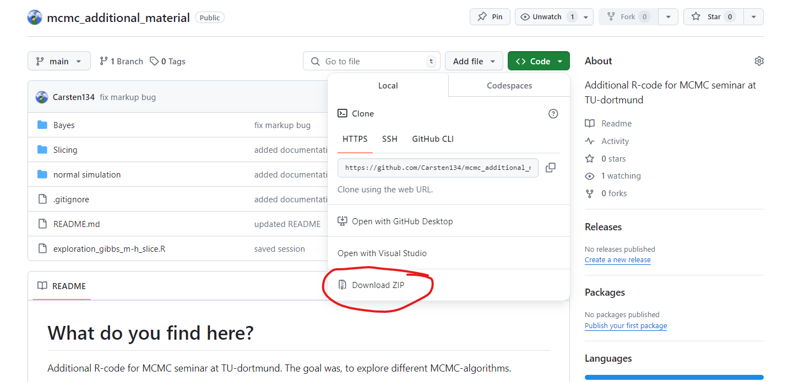

# What do you find here?
Additional R-code for MCMC seminar at TU-dortmund. The goal was, to explore different MCMC-algorithms.

We tried our best to explore as many different aspects of the field, ranging from implementing algorithms to exploring applications and limitations. All this work gave us a vast understanding of the topic, but also made it hard to string together in a cohesive report with a clear research question. Hence a lot of our findings didn't make it into the report. We still made sure to document everything we did in this repository and collect results.

## contents of this repository
- Comparison MLE and Bayesian logistic regression with simulated data
- Comparison Between Slice, Gibbs and M.H.
- Files for exploring Slicing
- Application of our `bayes_logit_reg_slice` function to titanic dataset
  - Full example [here](https://www.kaggle.com/code/carstenstahl/titanic-classification-using-bayes)


# How to grade and run the code:
If you have git you can just clone into the repository:

```
git clone https://github.com/Carsten134/mcmc_additional_material
```

The folder will appear in your working directory and you can from there open the files locally or import them into the cloud to run them there.

If you don't have git, you can download the zip file under `code>download ZIP`:
